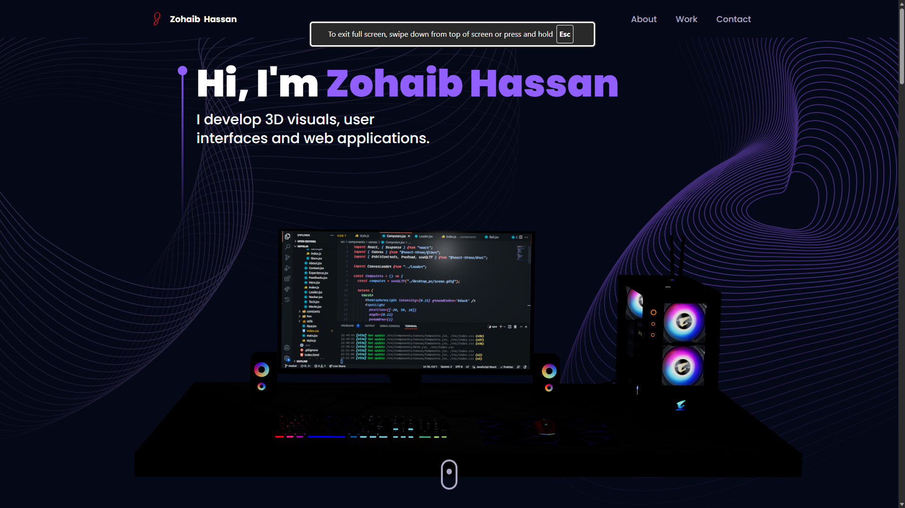
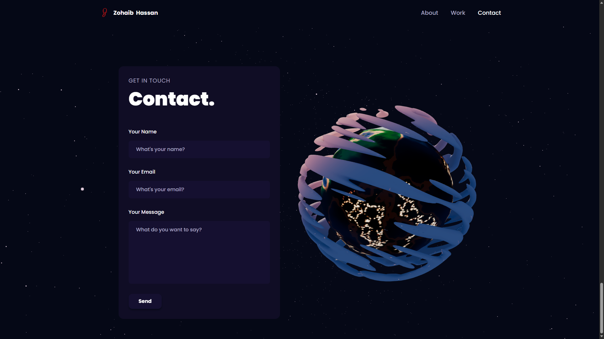

# Zohaib Hassan

A certified Software Engineer and IT Specialist with 2+ years of experience. This repository contains the source for the personal portfolio website showcasing projects, experience, skills, and contact information.

## Live / Links

- Portfolio homepage / source: <https://github.com/OtakuTotipotent>
- Here is the website preview: Portfolio Homepage



- And here is the contact section preview



## Summary

This portfolio is a single-page, responsive web application built with modern frontend tooling. It presents the author's biography, professional experience, highlighted projects, technical skills, and contact information. The site includes interactive UI elements and a small 3D canvas section (used for visual accents) to create a polished, modern presentation.

## Key Features

- Responsive, mobile-first layout for broad device support.
- Modular React components for each section: `Hero`, `About`, `Experience`, `Tech`, `Works`, `Feedbacks`, and `Contact`.
- Interactive 3D canvas elements (see `src/components/canvas`) used for subtle visual effects and engagement.
- Smooth animations and transitions driven by reusable motion utilities.
- Easily customizable styles via Tailwind CSS and component styles.

## Tech Stack

- React (JSX components in `src/`)
- Vite (development server and build tooling)
- Tailwind CSS (utility-first styles)
- JavaScript modules and modern ES tooling
- Optional 3D: Three.js / react-three-fiber for canvas components (refer to `src/components/canvas`)

## Project Structure (high level)

- `src/` — application source
  - `components/` — React UI components (Hero, About, Works, etc.)
    - `components/canvas/` — 3D canvas components (Ball, Computers, Earth, Stars)
  - `assets/` — project images, icons, and asset index
  - `constants/` — shared constants and metadata
  - `hoc/` — higher-order components / wrappers (e.g., `sectionWrapper.jsx`)
  - `utils/` — helper utilities (e.g., `motion.js`)
- `public/` — static files and textures used by the site
- `index.html`, `vite.config.js`, `tailwind.config.js` — build and styling configs

## Getting Started (local development)

Prerequisites:

- Node.js (LTS) and npm or Yarn

Common commands:

```bash
# install dependencies
npm install

# start local dev server
npm run dev

# build for production
npm run build

# preview production build locally
npm run preview
```

Notes:

- The project uses Vite for a fast development experience. If you use `yarn`, replace `npm` commands with `yarn` equivalents.
- If the 3D canvas uses additional native dependencies, ensure your environment supports WebGL (most modern browsers do).

## Deployment

The built site (output from `npm run build`) can be deployed to static hosting providers such as GitHub Pages, Netlify, Vercel, or any static-file host. Typical steps:

- Run `npm run build` to produce the `dist/` folder.
- Point your host to serve the `dist/` folder.

## Notes for Technical Visitors

- Component-driven: each section is implemented as a standalone React component to make it easy to extend or reuse.
- Animations: motion helpers live in `src/utils/motion.js` and are applied consistently across components.
- 3D canvas: see `src/components/canvas` for small illustrative scenes. These are designed to be decorative and lightweight — remove or replace them if you want a purely 2D experience.
- Routes: the site is primarily single-page and uses in-page anchors/sections rather than a router.

## Contributing

Contributions are welcome. Suggested workflow:

1. Fork the repository.
2. Create a feature branch (`git checkout -b feat/your-change`).
3. Make your changes and commit them.
4. Open a pull request with a clear description of the change.

If you plan to update or add content (new projects, new assets), please include optimized image sizes and keep 3D textures compact.

## Contact

For collaboration or inquiries, open an issue or contact the owner via the links on the portfolio site.

---

If you'd like, I can also:

- Add a short changelog section
- Create a `CONTRIBUTING.md` with more detailed guidelines
- Add deployment config for GitHub Pages, Vercel, or Netlify

Tell me which of these you want next.
